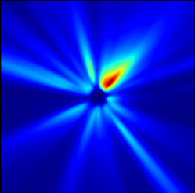

# Python Foreign Function Interface (FFI) Demo

Python is slow for CPU intensive calculations. If you are here, you probably know this. Potential solutions include judicious use of NumPy (compiled C library), Numba (JIT compiler) or AOT compiled code in a variety of languages (e.g. C, C++, Fortran, Rust) via one of the many available Foreign Function Interface (FFI) libraries.

This example project aims to implement a number of FFI examples in a scientific programming context, by using a simple atmospheric dispersion model to simulate intensive processing. This model contains a range of optimisable elements that can be represented in different ways (e.g. array calculations, lambda functions and data structures). Technical details of the dispersion model itself can be found [here](https://github.com/joshuanunn/really-simple-dispersion).

## FFI examples

* C (using ctypes)
* Fortran (using f2py) **in progress**

## Requirements

* Ideally a Linux environment to use as is, but would be possible to get working in Windows with a little work
* Python 3 distribution including NumPy (tested in Python 3.8) - will need a Jupyter distribution if you want to run the example notebooks
* C compiler (Makefile assumes gcc)
* Fortran compiler (Makefile assumes gfortran)

## Example setup, tests and usage for C (ctypes)

Created as a Python package, the main C source is [here](ffi_demo_ctypes/src/disperse.c), and there is a Python interface wrapper [here](ffi_demo_ctypes/core/interface.py), which allows for easy use. Python ctypes is included in the standard library. The C source needs to be compiled before use, and a basic Makefile is included to help with project setup. To (re)compile the shared C libraries (and optionally run tests), run the following from the base project directory:
```sh
$ make all
$ make test/ctypes
```

The Python wrapper allows for the easy initialisation of data structures that can be passed over the interface to compiled C to pass model setup options (e.g. ```domain```, ```source``` and ```methour``` below), or output arrays that can be edited inplace by the C code (e.g. ```r_grid``` and ```h_grid```):

```python
from ffi_demo_ctypes.core import *

# Setup a typical model run
domain = new_domain('HIGH')
source = new_source()
methour = new_methour()

# Simulate 250 hours of operation
methour.hours = 250

# Generate zeroed numpy arrays and run dispersion simulation
r_grid, h_grid = new_grids(domain)
iter_disp(r_grid, h_grid, domain, source, methour)
```

An example notebook is included [here](ctypes_example.ipynb), which shows how to visualise the outputs to generate images like the following:



## Contributing
Any pull requests to improve or add to the examples are very welcome!

## License
This software is released under the MIT license [MIT](LICENSE).

Elements of these examples are based upon equations derived from the Industrial Source Complex (ISC-3) atmospheric dispersion model developed by the US EPA. More details can be found in the ISC-3 user guide: [http://www.epa.gov/scram001/userg/regmod/isc3v2.pdf](http://www.epa.gov/scram001/userg/regmod/isc3v2.pdf).
